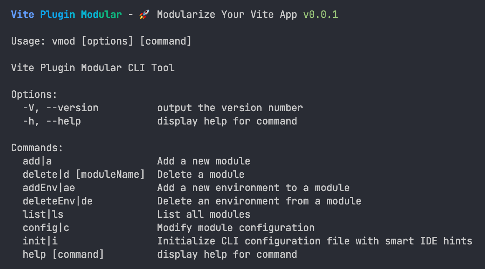

# Vite Plugin Modular

[](https://badge.fury.io/js/%40ad-feiben%2Fvite-plugin-modular)
[](https://opensource.org/licenses/MIT)

## 📦 项目简介

Vite Plugin Modular 是一个强大的 Vite 插件，用于管理多模块、多环境的前端项目。它提供了以下核心功能：

- 🚀 **多模块管理**：支持在单个项目中管理多个独立模块
- 🌍 **多环境配置**：为每个模块提供不同的环境配置
- 📁 **自动目录结构**：生成标准化的模块目录结构
- 🛠 **命令行工具**：提供便捷的 CLI 命令管理模块
- 🔧 **环境变量处理**：自动处理和注入环境变量
- 📝 **模块化配置**：支持模块化的配置文件管理

## 🚀 快速开始

### 安装

```bash
# 使用 npm
npm install @ad-feiben/vite-plugin-modular --save-dev

# 使用 yarn
yarn add @ad-feiben/vite-plugin-modular -D

# 使用 pnpm
pnpm add @ad-feiben/vite-plugin-modular -D
```

### 配置

1. **初始化配置**

```bash
# 使用 CLI 命令初始化
npx vmod init

# 或使用简写
npx vm init
```

2. **在 vite.config.ts 中注册插件**

```typescript
import { defineConfig } from 'vite'
import VitePluginModular from '@ad-feiben/vite-plugin-modular'

export default defineConfig({
  plugins: [
    VitePluginModular()
  ]
})
```

## 📖 使用指南

### 核心概念

1. **模块**：项目中的独立功能单元，每个模块有自己的源码目录、入口文件和配置
2. **环境**：每个模块可以有多个环境配置，如 development、production、test 等
3. **配置文件**：`.modular.config.jsonc` 用于存储模块配置信息

### 命令行工具

#### CLI 执行效果



#### 核心命令

| 命令        | 别名 | 描述                |
| ----------- | ---- | ------------------- |
| `add`       | `a`  | 添加新模块          |
| `delete`    | `d`  | 删除模块            |
| `addEnv`    | `ae` | 为模块添加环境      |
| `deleteEnv` | `de` | 从模块删除环境      |
| `list`      | `ls` | 列出所有模块        |
| `config`    | `c`  | 修改模块配置        |
| `init`      | `i`  | 初始化 CLI 配置文件 |

> 运行 `vmod --help` 查看完整的命令列表和详细说明

### 模块开发

1. **模块目录结构**

创建模块后，会自动生成以下目录结构：

```
src/modules/
├── module1/          # 模块目录
│   ├── main.ts       # 模块入口
│   └── style.css     # 模块样式
└── module2/
    ├── main.ts
    └── style.css
```

2. **代码共享建议**

为了保持模块的独立性和可维护性，不建议直接引用其他模块的内容。如果多个模块需要共享代码，建议：

- 将共享的函数、变量等提取到 `src` 目录下形成公共模块
- 使用 `src/utils` 目录存放通用工具函数
- 使用 `src/types` 目录定义共享类型
- 使用 `define` 配置共享环境变量

3. **环境配置**

在 `env` 目录中创建环境配置文件：

```
env/
├── .env.development  # 开发环境
├── .env.production   # 生产环境
└── .env.test         # 测试环境
```

4. **运行和构建**

```bash
# 运行特定模块的开发服务器
npm run dev:module1-dev

# 构建特定模块的生产版本
npm run build:module1-prod

# 构建特定模块的测试版本
npm run build:module1-test
```

## 🔧 配置说明

### 模块配置文件

模块配置文件 `.modular.config.jsonc` 存储了所有模块的配置信息：

```jsonc
{
  "module1": {
    "name": "module1",
    "sourceDir": "module1",
    "entry": "main.ts",
    "title": "Module 1",
    "outputDir": "module1",
    "environments": ["dev", "prod", "test"],
    "define": {
      "API_URL": "https://api.example.com",
      "APP_VERSION": "1.0.0"
    }
  },
  "module2": {
    "name": "module2",
    "sourceDir": "module2",
    "entry": "main.ts",
    "title": "Module 2",
    "outputDir": "module2",
    "environments": ["dev", "prod"],
    "define": {
      "API_URL": "https://api.example.com",
      "APP_VERSION": "1.0.0"
    }
  }
}
```

### 配置项说明

| 配置项         | 类型                | 描述                           |
| -------------- | ------------------- | ------------------------------ |
| `name`         | string              | 模块名称                       |
| `sourceDir`    | string              | 源码目录（相对于 src/modules） |
| `entry`        | string              | 入口文件（相对于源码目录）     |
| `title`        | string              | 页面标题                       |
| `outputDir`    | string              | 输出目录（相对于 dist）        |
| `environments` | string[]            | 环境列表                       |
| `define`       | Record<string, any> | 共享环境变量                   |

## 🎯 特性亮点

### 1. 环境变量注入

自动将 `define` 中的配置注入为环境变量：

```typescript
// 使用注入的环境变量
const apiUrl = import.meta.env.VITE_API_URL
const appVersion = import.meta.env.VITE_APP_VERSION
```

### 3. 智能命令生成

创建模块时，自动生成对应的 npm 脚本命令：

```json
{
  "scripts": {
    "dev:module1-dev": "vite --mode module1-dev",
    "build:module1-dev": "vite build --mode module1-dev",
    "dev:module1-prod": "vite --mode module1-prod",
    "build:module1-prod": "vite build --mode module1-prod",
    "dev:module1-test": "vite --mode module1-test",
    "build:module1-test": "vite build --mode module1-test"
  }
}
```

### 4. 优化的用户体验

- **彩色日志**：终端输出彩色日志，提高可读性
- **智能提示**：命令行交互时提供智能提示和选择
- **进度反馈**：操作过程中提供清晰的进度反馈
- **错误处理**：友好的错误提示和处理机制

## 📁 项目结构

```
vite-plugin-modular/
├── dist/             # 构建输出
├── src/              # 源码
│   ├── cli/          # 命令行工具
│   │   └── commands/ # 命令实现
│   ├── types/        # 类型定义
│   ├── utils/        # 工具函数
│   ├── config.ts     # 配置处理
│   └── plugin.ts     # 插件核心
├── schemas/          # JSON Schema
├── public/           # 静态资源
├── tests/            # 测试文件
└── example/          # 示例项目
```

## 🚧 开发指南

### 安装依赖

```bash
npm install
```

### 开发模式

```bash
npm run dev
```

### 构建项目

```bash
npm run build
```

### 运行测试

```bash
npm run test
```

## 🌟 示例项目

Vite Plugin Modular 包含一个完整的示例项目，位于 `example/` 目录中。您可以参考示例项目了解如何使用插件：

```bash
# 进入示例目录
cd example

# 安装依赖
npm install

# 运行示例模块
npm run dev:module1-dev
```

## 🤝 贡献指南

我们欢迎社区贡献！如果您有任何建议或改进，请：

1. Fork 本仓库
2. 创建特性分支
3. 提交更改
4. 开启 Pull Request

## 📄 许可证

本项目采用 MIT 许可证。详见 [LICENSE](LICENSE) 文件。

## 📞 支持

如果您在使用过程中遇到问题，可以：

1. 查看 [示例项目](example/) 了解使用方法
2. 检查 [配置说明](#-配置说明) 确认配置正确
3. 提交 [Issue](https://github.com/AD-feiben/vite-plugin-modular/issues) 报告问题

## 📝 更新日志

### v0.0.1
- ✨ 初始化项目
- 🚀 实现核心模块化功能
- 🛠 开发命令行工具
- 🎨 设计插件 logo
- 📖 编写文档

## 🌟 鸣谢

- [Vite](https://vitejs.dev/) - 现代前端构建工具
- [Commander.js](https://github.com/tj/commander.js) - 命令行工具
- [Inquirer.js](https://github.com/SBoudrias/Inquirer.js) - 交互式命令行
- [Chalk](https://github.com/chalk/chalk) - 终端彩色输出
- [TypeScript](https://www.typescriptlang.org/) - 类型安全的 JavaScript

---

**Vite Plugin Modular** - 让前端模块化开发更简单！🚀
